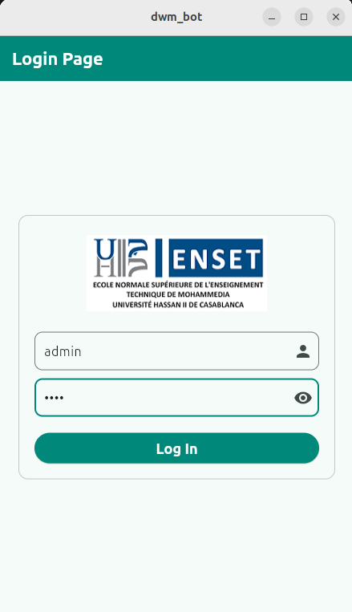
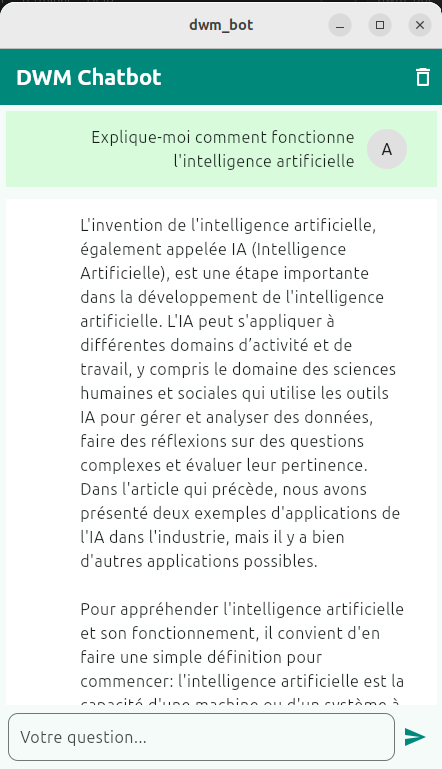

# 🤖 Flutter Chatbot LLM — DWM Bot

<p align="center">
  
  
  
  
  
</p>

<p align="center">
  Application mobile Flutter multi-plateforme permettant à un utilisateur de s'authentifier,
  puis d'accéder à un chatbot intelligent connecté à un modèle IA (Llama3 ou ChatGPT).
</p>

---

## 📸 Screenshots

<p align="center">
  
  &nbsp;&nbsp;&nbsp;&nbsp;&nbsp;
  
</p>

<p align="center">
  <b>Login Page</b>
  &nbsp;&nbsp;&nbsp;&nbsp;&nbsp;&nbsp;&nbsp;&nbsp;&nbsp;&nbsp;&nbsp;&nbsp;&nbsp;&nbsp;&nbsp;&nbsp;&nbsp;&nbsp;&nbsp;&nbsp;&nbsp;&nbsp;&nbsp;&nbsp;&nbsp;&nbsp;&nbsp;&nbsp;
  <b>DWM Chatbot</b>
</p>

---

## 📋 Objectif du TP

Développer une application mobile **cross-platform** avec Flutter qui permet de créer un Chatbot interagissant avec des **LLMs** (Large Language Models) tels que :
- 🦙 **Ollama** — Llama3 / TinyLlama (local)
- 🤖 **OpenAI** — GPT-4o-mini (cloud)

---

## 📱 Fonctionnalités

| Fonctionnalité | Statut |
|----------------|--------|
| Écran de login avec logo ENSET | ✅ |
| Validation des champs (Form + Validator) | ✅ |
| Affichage/masquage du mot de passe | ✅ |
| Navigation Login → Chatbot | ✅ |
| Envoi de questions en langage naturel | ✅ |
| Appel API HTTP/JSON vers LLM | ✅ |
| Bulles de conversation colorées | ✅ |
| Avatar utilisateur et robot | ✅ |
| Défilement automatique (ScrollController) | ✅ |
| Indicateur de chargement (CircularProgress) | ✅ |
| Gestion des erreurs réseau | ✅ |
| Bouton corbeille pour effacer le chat | ✅ |

---

## 🏗️ Architecture du projet

```
dwm_bot/
├── lib/
│   ├── main.dart                  ← Point d'entrée + ThemeData (couleur verte)
│   └── pages/
│       ├── login_page.dart        ← Écran de connexion (StatefulWidget)
│       └── chat_page.dart         ← Chatbot + appel API LLM
├── images/
│   └── enset.png                  ← Logo ENSET Mohammedia
├── screenshots/
│   ├── 111.png                    ← Capture Login Page
│   └── 222.png                    ← Capture Chat Page
└── pubspec.yaml                   ← Dépendances Flutter
```

---

## 🚀 Installation et lancement

### Prérequis
```bash
# Vérifier Flutter
flutter --version   # Flutter 3.32.0+

# Installer les dépendances
flutter pub get
```

### ▶️ Option 1 — Ollama (Llama3 local, gratuit)

```bash
# Terminal 1 — Lancer le modèle IA
ollama run tinyllama

# Terminal 2 — Lancer l'application
cd dwm_bot
flutter run -d linux        # Linux Desktop
flutter run                 # Android (téléphone connecté)
```

> ⚠️ Sur Android réel, remplacer `localhost` par l'IP de votre machine dans `chat_page.dart` :
> ```dart
> const String _apiUrl = 'http://192.168.X.X:11434/api/chat';
> ```

### ▶️ Option 2 — OpenAI GPT (cloud)

Modifiez `lib/pages/chat_page.dart` :
```dart
const String _apiUrl = 'https://api.openai.com/v1/chat/completions';
const String _model  = 'gpt-4o-mini';
const String _apiKey = 'VOTRE_CLE_API_ICI';
```

---

## 🔑 Identifiants par défaut

| Champ    | Valeur  |
|----------|---------|
| Username | `admin` |
| Password | `1234`  |

---

## 🌐 Architecture API

```
┌─────────────────────────────┐
│     Application Flutter      │
│  (login_page + chat_page)    │
└────────────┬────────────────┘
             │ HTTP POST
             │ Content-Type: application/json
             ▼
  ┌──────────────────────┐        ┌──────────────────────┐
  │  Ollama (local)       │   OU   │  OpenAI API (cloud)   │
  │  localhost:11434      │        │  api.openai.com       │
  │  /api/chat            │        │  /v1/chat/completions │
  └──────────┬───────────┘        └──────────┬────────────┘
             │                               │
             ▼                               ▼
       TinyLlama / Llama3              GPT-4o-mini
```

---

## 💻 Code — Fichiers principaux

### `lib/main.dart`
```dart
import 'package:flutter/material.dart';
import 'pages/login_page.dart';

void main() => runApp(const MyApp());

class MyApp extends StatelessWidget {
  const MyApp({super.key});
  @override
  Widget build(BuildContext context) {
    return MaterialApp(
      title: 'DWM Chatbot',
      debugShowCheckedModeBanner: false,
      theme: ThemeData(
        primaryColor: const Color(0xFF00897B),
        colorScheme: ColorScheme.fromSeed(seedColor: const Color(0xFF00897B)),
        indicatorColor: Colors.white,
        useMaterial3: true,
      ),
      home: const LoginPage(),
    );
  }
}
```

### `lib/pages/login_page.dart` — Points clés
```dart
// TextEditingController pour récupérer les valeurs
final TextEditingController _usernameController = TextEditingController();
final TextEditingController _passwordController = TextEditingController();

// GlobalKey pour la validation du formulaire
final _formKey = GlobalKey<FormState>();

// Obscure text pour masquer le mot de passe
bool _obscurePassword = true;

// Validation : admin / 1234
if (username == 'admin' && password == '1234') {
  Navigator.pushReplacement(context,
    MaterialPageRoute(builder: (_) => ChatPage(username: username)));
}
```

### `lib/pages/chat_page.dart` — Points clés
```dart
// Configuration API
const String _apiUrl = 'http://localhost:11434/api/chat';
const String _model  = 'tinyllama';

// Liste des messages
final List<Map<String, String>> messages = [];

// Appel HTTP vers Ollama
final response = await http.post(uri,
  headers: {'Content-Type': 'application/json'},
  body: json.encode({
    'model': _model,
    'messages': [{'role': 'user', 'content': question}],
    'stream': false,
  }));

// Extraction de la réponse
final answer = json.decode(response.body)['message']['content'];
```

---

## 📦 Dépendances (`pubspec.yaml`)

```yaml
dependencies:
  flutter:
    sdk: flutter
  http: ^1.2.0             # Appels HTTP vers l'API LLM
  cupertino_icons: ^1.0.6
```

---

## 🛠️ Technologies utilisées

| Technologie | Version | Usage |
|-------------|---------|-------|
| Flutter | 3.32.0 | Framework mobile |
| Dart | 3.8.0 | Langage de programmation |
| package `http` | ^1.2.0 | Appels API REST |
| Ollama | latest | Serveur LLM local |
| TinyLlama | 1.1B | Modèle IA léger |
| OpenAI GPT | 4o-mini | Modèle IA cloud |
| Android Studio | 2025.3.4 | IDE |

---

## 🧪 Tests effectués

| Test | Résultat |
|------|----------|
| Login avec admin/1234 | ✅ Succès |
| Login avec mauvais identifiants | ✅ SnackBar erreur |
| Question : "Explique-moi comment fonctionne l'intelligence artificielle" | ✅ Réponse reçue |
| Question : "Bonjour, comment tu vas ?" | ✅ Réponse en français |
| Test sur Linux Desktop | ✅ Fonctionnel |
| Test sur Android réel | ✅ Fonctionnel |

---

## 👩‍🎓 Informations académiques

| | |
|--|--|
| **Étudiante** | Faiza ERRIHANI |
| **Établissement** | ENSET Mohammedia |
| **Université** | Hassan II de Casablanca |
| **Module** | Développement Mobile Flutter |
| **TP** | Activité Pratique N°2 — Mobile Chatbot with LLMs |
| **Encadrant** | Mohamed Youssfi |
| **Référence vidéo** | [YouTube — DWM Flutter Chatbot](https://youtu.be/DXIkiU6EdZE) |
| **GitHub** | [faizaERRIHANI/flutter-chatbot-llm](https://github.com/faizaERRIHANI/flutter-chatbot-llm) |

---

<p align="center">
  Réalisé avec Faiza ERRIHANI à l'ENSET Mohammedia
</p>
